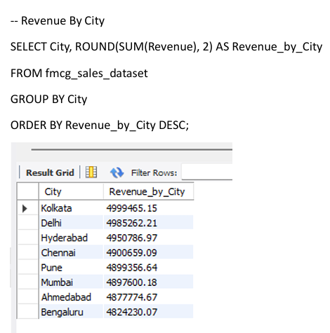
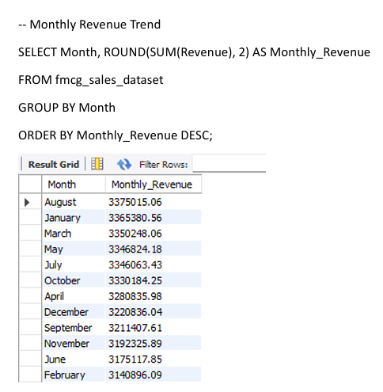
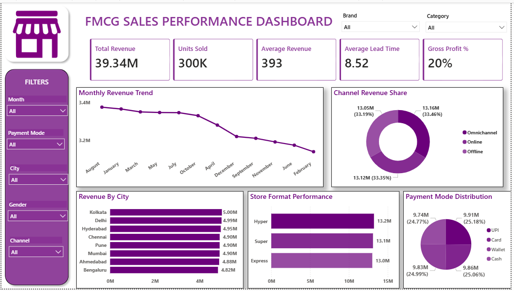

<h1>📊 Project Title</h1>
<h2>FMCG Retail Sales Performance Analysis</h2>

<h1>📋 Project Overview</h1>

This project analyzes FMCG Retail Sales data to identify sales trends, profitability, product performance, and regional revenue distribution

The dashboard helps business stakeholders make data-driven decision regarding inventory planning, product, strategy, and market expansion

<h1>🎯 Business Problem</h1>

The leadership has noticed inconsistents revenue performance across cities, and store formats, declining margins on certain product categoriws and growing inventory inefficiencies

<h3>Busniess Obectives</h3>
<ol>
  <li>Identify top-performing and under performing cities, store format and product categories by revenue and margin</li>
  <li>Analyze Channel performance</li>
  <li>Uncover seasonal and monthly sales trends across categories to support demand forcasting and promotional planning</li>
</ol>

<h1>📁 Dataset Infromation</h1>
<ul>
  <li>Source : Kaggle</li>
  <li>Keywords : FMCG Sales Dataset</li>
</ul>

<h1>🛠️ Tools Used</h1>
<ol>
  <li>SQL (Data Analysis)</li>
  <li>Python(Pandas) (Data Cleaning)</li>
  <li>Power BI (Dashboard Development)</li>
</ol>

<h1>📈 KPI's</h1>
<ol>
  <li>Total Revenue</li>
  <li>Units Sold</li>
  <li>Average Revenue</li>
  <li>Average Lead Time</li>
  <li>Gross Profit %</li>
</ol>

<h1>🔍 SQL Analysis</h1>

Which city has generated the highest Revenue?

Which Store Format generated highest profit?

What is monthly Sales Trend?

<h1>📷 Dashboard Preview</h1>

<h1>💡 Key Insights</h1>
<ol>
  <li>Kolkata leads Revenue, Bengaluru is the weakest city creating a gap of 0.18M</li>
  <li>Omnichannel is the top revenue channel, but all three channels are near equal</li>
  <li>Hyper Store outperform, Express format lags by 0.2M</li>
  <li>August is the peak revenue month, February is the weakest creating a gap of 0.23M</li>
  <li>UPI is the #1 payment mode, Cash trails all digital methods</li>
</ol>

<h1>🚀 Recommendations</h1>
<ol>
  <li>Increase inventory for high demand categories</li>
  <li>Focus marketing efforts on top-performing cities</li>
  <li>Expand high margin store formats</li>
  <li>Monitor underperforming products for optimization</li>
</ol>
